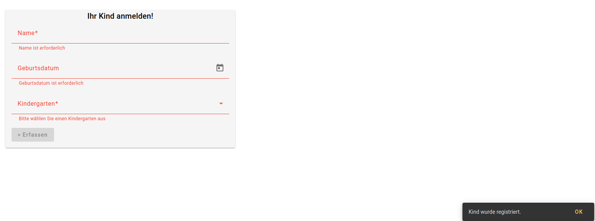
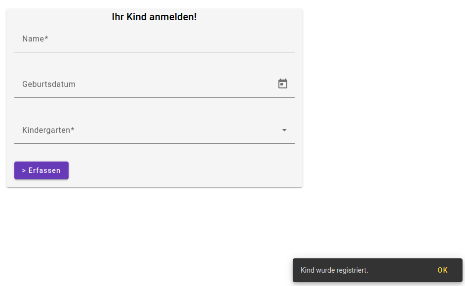
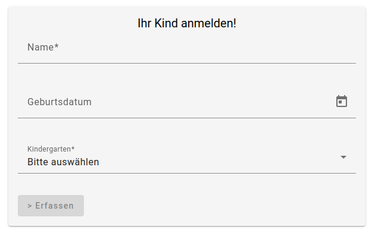
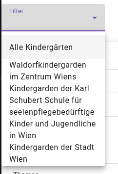
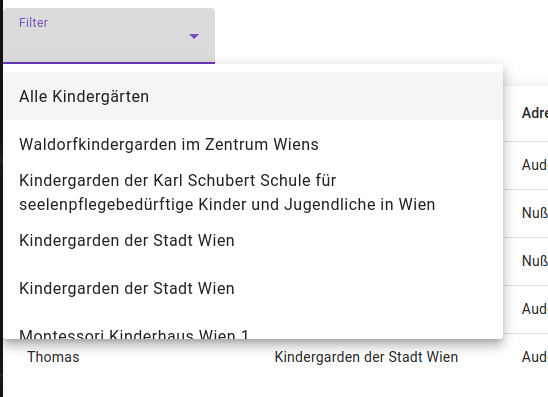
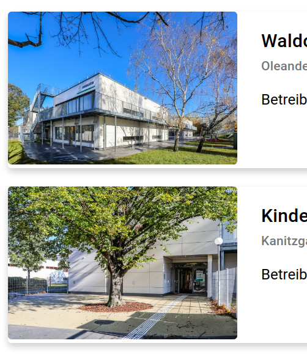
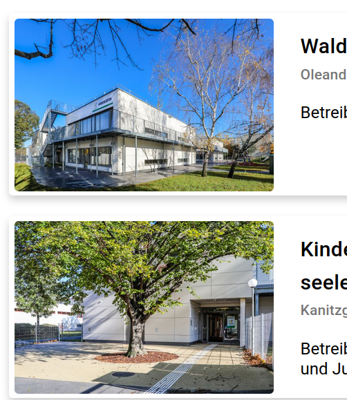
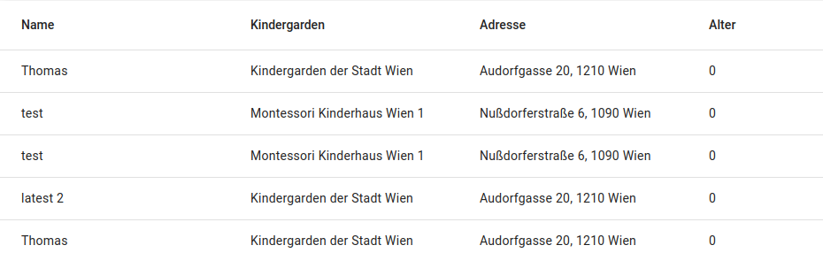
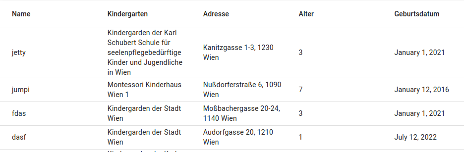

# UX - Review

## 1. Form

### 1.1 Validierung

Nach dem erfolgreichen speichern des Formulars, werden die einzelnen Formfelder nicht zurückgesetzt.

Nach dem erfolgreichen speichern des Formulars, werden die einzelnen Formfelder zurückgesetzt.

### 1.2 Überschrift

Die Überschrift hält nicht den Standard abstand von 16px ein. Das Problem konnte mit der richtigen material class (mat-card-header) gelöst werden.

## 2. Filter

Der Filter für die Kindergärten ist zu klein. Es ist schwierig die einzelnen Kindergärten zu finden.

Um die einzelnen Kindergärten besser zu finden, wird der Filter vergrössert.

### 3. Kindergärten Cards

Die Bilder in den Cards sind nicht der card angepasst.

Die Bilder in den Cards wurden angepasst. Alle bilder haben nun die gleiche Grösse, und margin.

### 4. Tabelle

In der Tabelle konnten zwei Fehler festgestellt werden:

### 4.1 Namensgebung

Die Namensgebung der Spalten ist nicht einheitlich. Die Spalte `Kindergarden` sollte `Kindergarten` heißen.

### 4.2 Alters validierung

Die Alters validierung ist nicht korrekt. Das Kind kann nicht in einen Kindergarten angemeldet werden, wenn es jünger als 3 Jahre ist.

### 4.3 Geburtsdatum

Das Geburtsdatum wird nicht auf Deutsch angezeigt.

### 4.4 Registrierungsdatum

Das Registrierungsdatum wird nicht auf Deutsch angezeigt.
